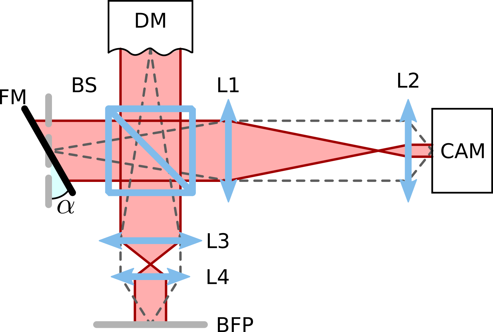
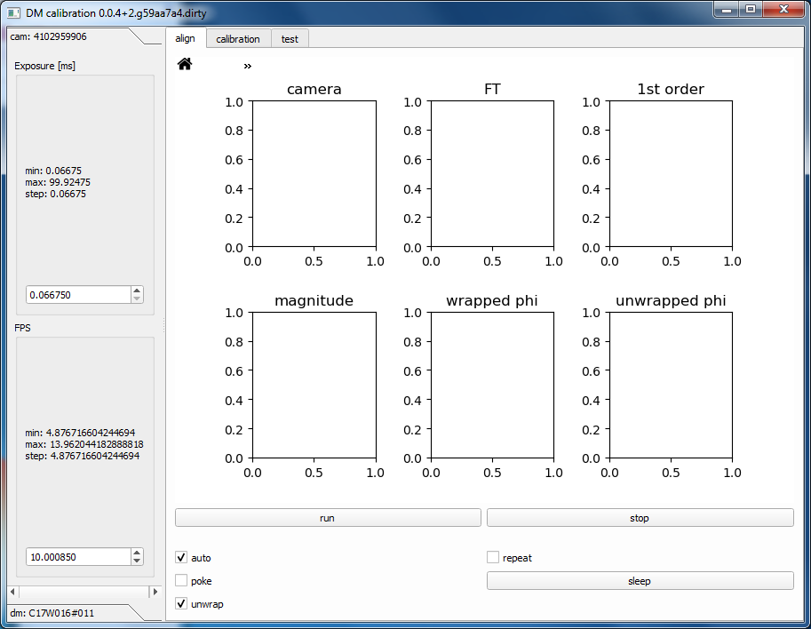
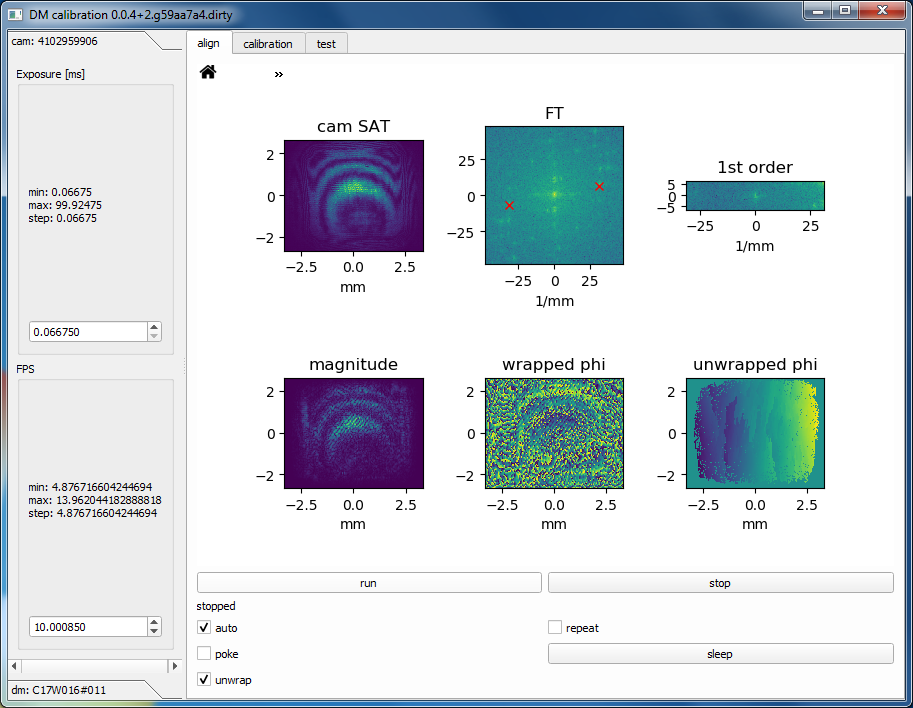
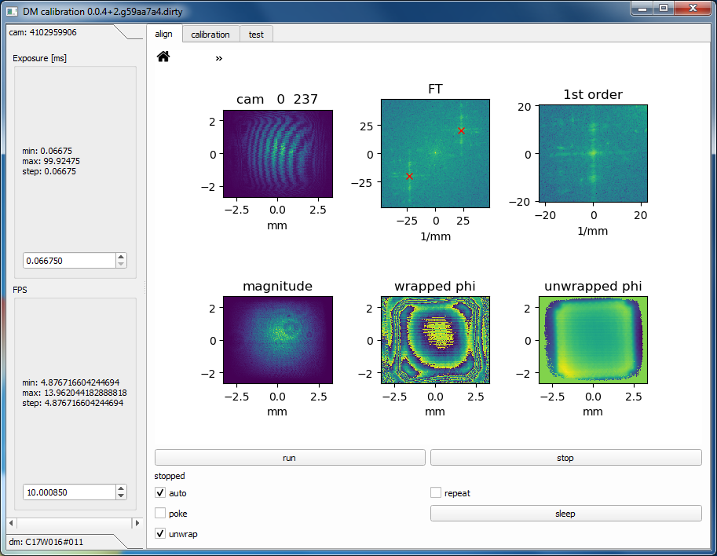
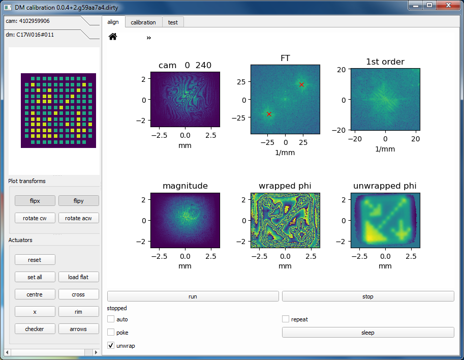
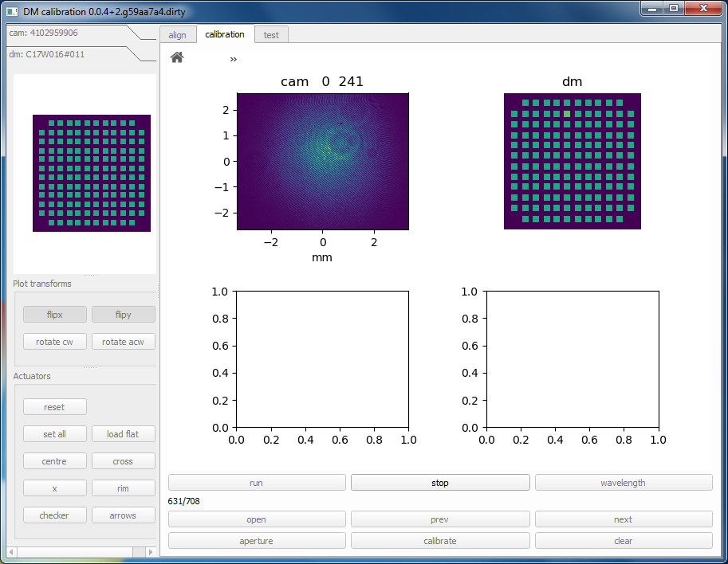
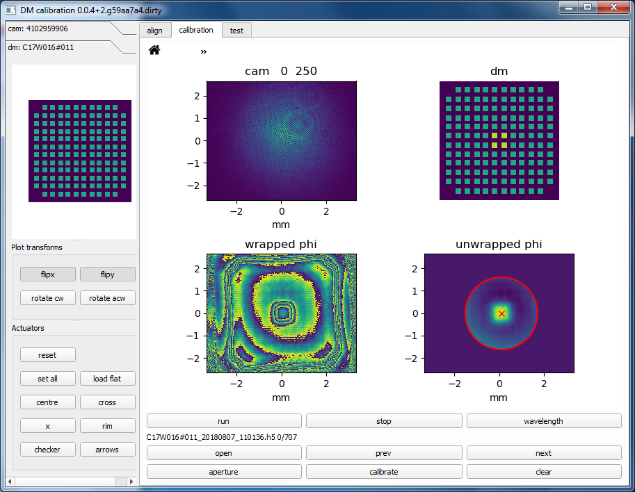
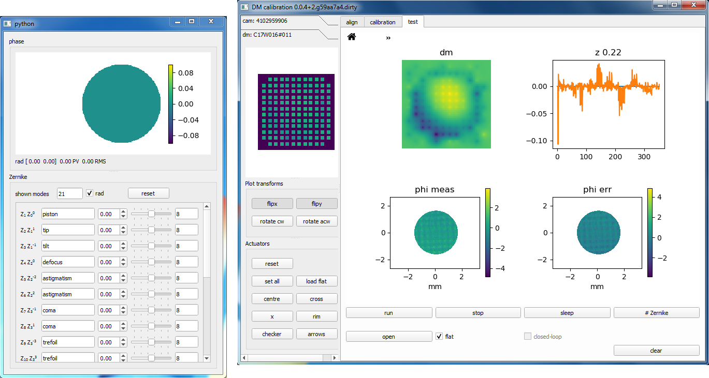
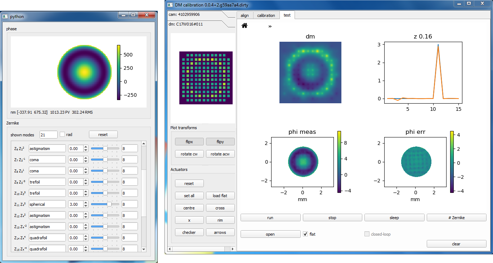
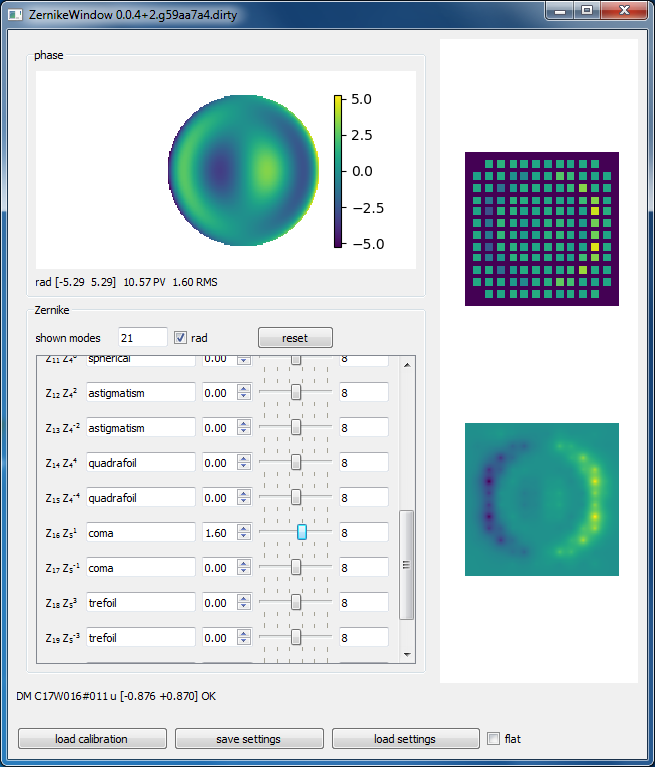

# Introduction

This guide describes in detail how to use `dmlib` to calibrate a deformable
mirror (DM). You need to build an interferometer around your DM for this
purpose, such as the one depicted in the figure below. The `dmlib` library
implements the calibration method outlined in this
[tutorial](https://doi.org/10.5281/zenodo.3714951) from
[aomicroscopy.org](https://aomicroscopy.org).

The library includes two GUIs. The first one, `dmlib.gui`, is used to acquire
interferometric data and compute the calibration itself. All parameters of the
calibration are selected automatically and the user should only provide the
radius of the aperture. This is the radius of the back aperture of the microscope
objective that is imaged onto the surface of the DM.  The second GUI,
`dmlib.zpanel`, loads a calibration file and allows to control the DM using
Zernike coefficients.

If your DM or camera are not directly supported by `dmlib`, you can write your
own script to collect the interferometric data and use `dmlib`'s functions to
compute the calibration. A template script for this purpose is found in the
`example` folder.  The rest of the guide describes how to use the GUIs instead.

# Deformable mirror calibration (dmlib.gui)

After installing `dmlib`, you can launch the calibration GUI (`dmlib.gui`) by
double-clicking on `examples/run_calibration_gui.bat`. This will start up the
calibration GUI in simulation mode, i.e., opening dummy devices instead of
using real hardware. To start using actual devices you need to edit the BAT
file as explained below.

First you need to select which drivers to use. This can be done with the
`--dm-driver` flag for DMs and with the `--cam-driver` flag for cameras. To get
a list of the available drivers you can print out the command line help for the
GUI, by appending the `--help` flag. If you have multiple connected devices
handled by the same driver, such as two DMs from the same manufacturer, you can
select which one to use by specifying the serial number with `--dm-name
SERIAL_NUMBER`. Append the `--dm-list` flag to get a list of the detected DMs
for the selected driver. Similar flags exist for the camera devices.

In principle, you can acquire a *calibration dataset* once only. This dataset
stores the images collected by the interferometer and can be subsequently
loaded by the GUI in the future, without requiring access to the interferometer
again. Using the data stored in a *calibration dataset* you can generate a
*calibration file*, which comprises a calibration of the DM for a particular
pupil size. You can create multiple *calibration files* from the same
*calibration dataset*, which can be useful if you use the DM with multiple
objectives with different back aperture sizes.

## Acquiring a calibration dataset
1.  Open the calibration GUI (`dmlib.gui`).
2.  In the **align** tab, hit **run** and adjust the exposure time of the
    camera or the power of the laser until the saturation warning (SAT) is not
    displayed anymore in the **cam** figure (top-left). 
    
3.  Enable **repeat** and hit **run** to acquire continuously. Then
    adjust the tilt **ɑ** of the reference mirror **FM** until the red
    crosses in the **FT** figure are at 45 degrees as shown below. Hit
    **stop** when finished adjusting the tilt. Large tilt values allow
    for an accurate measurement of the phase. When the GUI is stopped,
    you can zoom in any of the graphs by clicking on the home icon in
    the top-left hand corner. 
    
4.  Disable **repeat**. Pull up the **dm:** panel (bottom-left) and click
    **arrows**. Then **run** again. Use **flipx**, **flipy**, **rotate cw**,
    and **rotate acw** to adjust the orientation of the actuators plot until
    they match the interferometric measurement displayed in the figure
    **unwrapped phi**. Note that **auto** checkbox enables automatic detection
    of the first-order and only works when the DM is at rest after pressing
    **reset** on the **dm:** panel. When **auto** is disabled, the previous
    location of the first-order is used to extract the phase. 
    
5.  Move to the **calibration** panel and hit **run** to record a
    *calibration dataset*. 
    

Note that the interferometer is very sensitive to vibrations, which should be
minimised to ensure a good quality dataset. For example, if using a pellicle
beamsplitter, the interferometer measurements could be disrupted by vibrations
due to cooling fans in the equipment or people speaking in the vicinity.

## Creating a calibration file

1.  After acquiring a *calibration dataset* you can examine it by selecting an
    index with **open**, **prev,** and **next**. Alternatively, if you did not
    perform the data collection or hit **clear**, you can load a previously saved
    *calibration dataset* with **open**
2.  To create a *calibration file* from the *calibration dataset*, choose an
    aperture size with **aperture**. The GUI asks for the radius as seen from
    the camera of the interferometer. Say the back aperture of the microscope
    objective has radius $R_a$, the magnification between the back aperture and
    the DM is $M_1$, and the magnification between the DM and camera of the
    interferometer is $M_2$. Then the radius to enter would be $R_a M_1 M_2$.
    You may have to tune the illumination and the fringe contrast if the GUI
    fails to detect the centre of the DM. 
    
3.  Click on **calibrate**. The time necessary to compute a *calibration
    file* can vary significantly depending on the fill factor of the
    aperture with respect to the full camera size and on the performance
    of the PC. Once the calibration is completed, a quality indicator is
    reported besides the *calibration file* name. This indicator is
    between 0% and 100%. Good calibration results are expected for
    around 90% or more. 
    

## Testing a calibration file with the interferometer

1.  Move to the the **test** tab to test a *calibration file* with the
    interferometer. 
    

2.  Click on **\# Zernike** to select the maximum number of Zernike
    coefficients plotted in the **Zernike **figure (top-right hand corner). The
    error between the desired Zernike coefficients (in blue) and the ones
    effectively measured by the interferometer (in orange) is shown in the
    **Zernike** figure and should be small for a good calibration. This error
    is reported in radians in the calibration laser wavelength. Note that
    if you repeat this test after realiging the interferometer or after
    changing the tilt **ɑ** of the reference mirror **FM**, you will
    generally measure a large error. This error is of no concern as it only
    reflects the change in the alignment of the interferometer. 
    

## Example calibration dataset

A sample *calibration dataset* can be obtained
[here](https://drive.google.com/file/d/1koAdxAXhjp-ZGuQk-mp8leNyF95HJKCr/view?usp=sharing).
In case you have issues with your interferometer, it can be useful to compare
your dataset against this one for reference. For example you can check whether
your have poor fringe contrast or an uneven illumination profile.

# Deformable mirror control using Zernike modes (dmlib.zpanel)

1.  Open the Zernike control GUI (`dmlib.zpanel`). This GUI accepts flags
    similar to the ones of `dmlib.gui`, so you can specify a DM driver and DM
    name accordingly. The GUI will ask for a *calibration file*. Note that
    unless you force use of a particular DM with the `--dm-name` flag, the GUI
    will look for the DM name written inside the *calibration file*. Also the
    `--dm-driver` and `--dm-name` flags should be consistent. So if you use
    `--dm-driver sim`, only `simdm0` and `simdm` will be available.
2.  Use the control panel to set the right amount of Zernike aberration. 
    
3.  You can visually inspect the quality of the calibration by disabling *flat*
    and examining the actuator patterns generated for each Zernike mode.

# Using the calibration with external software

You can use the *calibration file* generated with `dmlib.gui` with your own
code written for example in MATLAB or with LabVIEW. The *calibration file*
format is [HDF5](https://en.wikipedia.org/wiki/Hierarchical_Data_Format). To
export the calibration into a text file, see `export_calibration.py` in the
`examples` folder.

Note that `dmlib` uses the conventions outlined below. Your code must apply the
correct transformations to obtain the desired shape of the DM.

- *z*; Zernike coefficients in rad relative to the calibration wavelength;
  Use lambda/(2pi) to convert to nm;
- *u*; [-1, 1]; control variable used by dmlib
- *v*; [-1, 1]; linearised voltage used by dmlib
- *r*; [rmin, rmax]; real voltage accepted by your DM driver
- *dmtx*; linearisation function
- *C*; DM control matrix

For linear DMs, *dmtx* is simply *v = u*. For electrostatically actuated DMs the
displacement of a single actuator varies quadratically with respect to the
applied voltage. This non-linearity can be approximately removed by using the
square root of the voltage as the control variable *u*. So in this case *dmtx* is
*2*sqrt((u + 1)/2) - 1*.

To compute the real voltage *r* to apply to the DM driver, use the equations below:
- u = uflat + C*z
- v = dmtx(u)
- r = rmin + (rmax - rmin)*(v + 1)/2

# References
<a id="1">[1]</a> J. Antonello, J. Wang, C. He, M. Phillips, and M. Booth, "Interferometric calibration of a deformable mirror," [10.5281/zenodo.3714951](https://doi.org/10.5281/zenodo.3714951).
